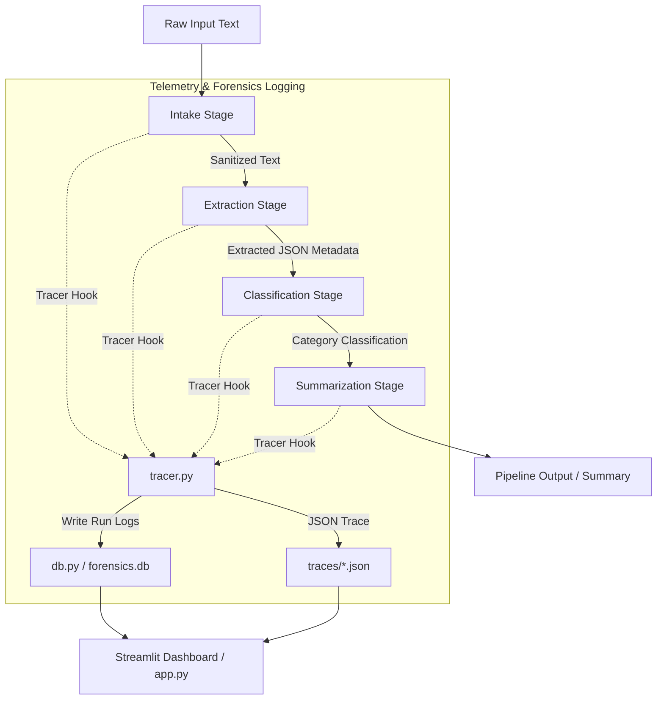

# 🔍 AI Pipeline Failure Forensics Explorer

A premium developer analytics dashboard and runtime diagnostic tool for tracing, analyzing, and debug-profiling failures in multi-stage generative AI pipelines (Intake, Extraction, Classification, and Summarization).

---

## 🚀 Key Features

* **Interactive Trace Visualizer**: Visually step through multi-stage AI pipelines with status indicators (Success, Warning, Failure) and execution latency details.
* **Auto-generated Root Cause Analysis**: Automated diagnostics pinpointing issues such as API rate limits, model hallucination/low confidence, structural format errors, and validator failures.
* **Real-time Metrics**: Track overall pipeline health, run status ratios, average latency per step, and error rates using premium Plotly graphs.
* **Telemetry Driven**: Built using OpenTelemetry-like tracer hooks to generate structured JSON trace files dynamically.
* **Hugging Face Inference with Mock Fallback**: Integrates with Hugging Face models for natural language processing, with automated mock fallbacks for local offline execution.

---

## 🛠️ Architecture



---

## 📁 Project Directory Structure

```text
├── .gitignore              # Ignored folders (.venv, traces, database, etc.)
├── requirements.txt        # Package dependencies
├── app.py                  # Streamlit forensic explorer dashboard app
├── pipeline.py             # Main AI pipeline runner with Pydantic validations
├── analyzer.py             # Diagnostic and Root Cause Analysis helper logic
├── tracer.py               # Trace instrumenting and JSON logging utility
├── db.py                   # SQLite storage utility for pipeline runs
├── generator.py            # Script/helper to generate sample runs
└── traces/                 # Folder containing telemetry JSON files (local git-ignored)
```

---

## ⚡ Setup & Installation

### 1. Prerequisite Packages
Ensure you have Python 3.10+ installed. Clone or copy this directory, then install the dependencies:
```bash
pip install -r requirements.txt
```

### 2. Configure Environment Variables
The pipeline can run either using Hugging Face's active inference API or offline via mock execution:

* **Mock Mode (Default / Offline)**:
  To run the dashboard and pipeline with simulated model outputs and errors (perfect for testing and local exploration):
  ```bash
  $env:USE_MOCK_LLM="true"
  ```

* **Live Mode (Using Hugging Face)**:
  Set `USE_MOCK_LLM` to `false` and set your `HF_TOKEN`:
  ```bash
  $env:USE_MOCK_LLM="false"
  $env:HF_TOKEN="your_huggingface_personal_token"
  ```

---

## 🖥️ Running the Application

Start the Streamlit dashboard on your local machine:
```bash
streamlit run app.py
```
This will spin up a premium analytical interface on `http://localhost:8501/` where you can inspect run timelines, review execution logs, analyze node-level input/outputs, and run manual diagnostics.
